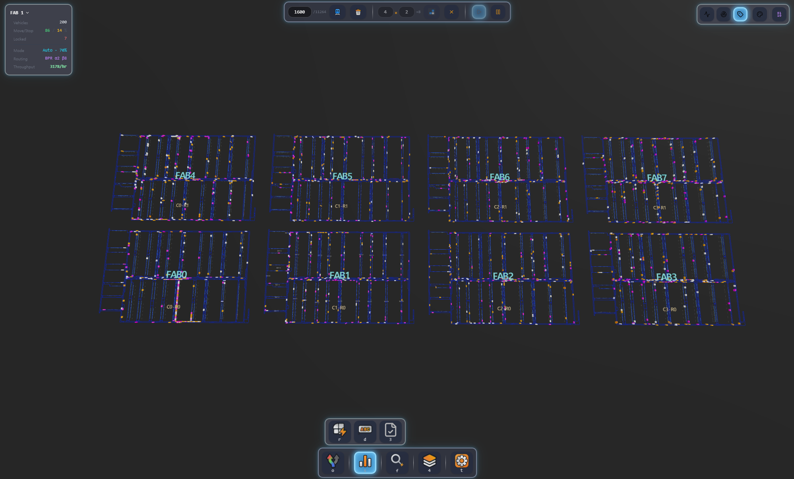
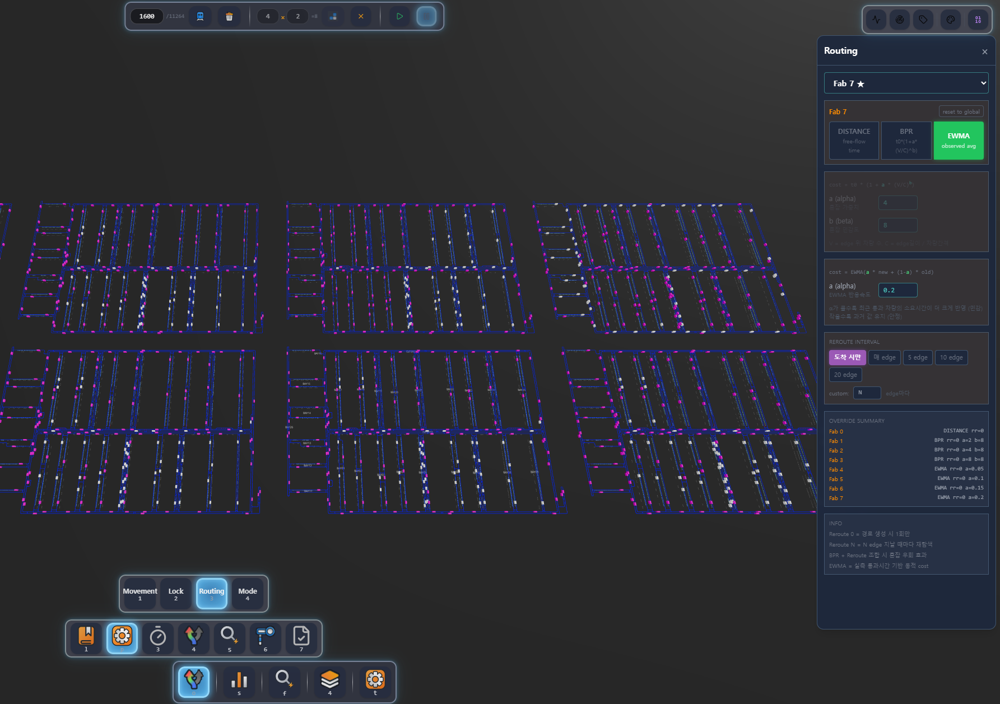
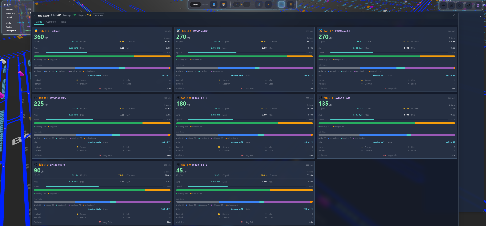
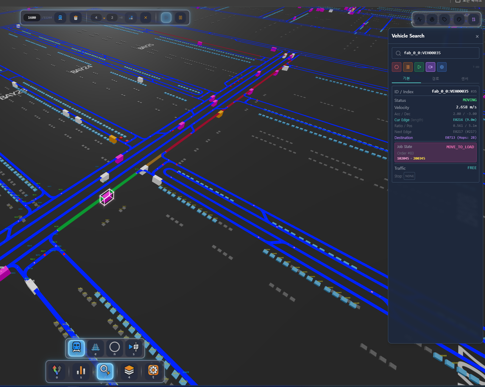

# VPS — Virtual Physics Simulator

> 반도체 FAB 내 OHT(Overhead Hoist Transport) 차량의 **대규모 라우팅 비교 시뮬레이터**.
> 같은 맵에서 라우팅 전략(Distance / BPR / EWMA)을 동시에 돌려 **어느 게 더 효율적인지** 한 화면에서 비교한다.



---

## 무엇을 하는가

- **N개의 FAB을 평행우주처럼 동시에 시뮬레이션**한다. 각 FAB은 독립된 Web Worker에서 돌고, 라우팅·주문 분배·속도 제어·락 정책을 다르게 줄 수 있다.
- 차량은 SharedArrayBuffer 위에서 살며, 위치/속도/상태를 워커가 쓰고 메인 스레드의 Three.js가 읽기만 한다. **postMessage로 위치를 주고받지 않는다** (zero-copy).
- 결과는 실시간 KPI 카드 + 비교 차트 + 타임라인 트렌드로 즉시 본다.

## 핵심 시각화

### Fab Config — fab별 파라미터 설정
라우팅 전략(BPR α/β, Random Walk 등) · IDLE policy · vehicle 수 등 fab마다 독립적으로 세팅. 같은 토폴로지에 다른 정책을 꽂아 동시 비교할 수 있다.



### Fab Stats — 다중 fab 실시간 통계
Throughput / Avg Speed / Moving% / Locked / Collision 등 metric을 fab 간 카드·차트로 한눈에. 어떤 전략이 이기고 있는지 실시간으로 보인다.



### Vehicle Info — 개별 차량 상세
선택한 vehicle의 현재 edge / ratio / 경로 / lock 상태 / 대기 큐 등 디버깅 정보. 특정 차량의 정체·deadlock 원인 추적용.



---

## 아키텍처 한 장 요약

**메인 스레드 = 렌더링만, 워커 = 시뮬레이션만, 통신 = SharedArrayBuffer.**

```
┌──────────────────────────────────────────────────────────────────┐
│                        Main Thread                                │
│   React UI    +    Zustand stores    +    Three.js renderer       │
│                                                  ↑                │
│                                       READ ONLY │                 │
│  ┌───────────────────────────────────────────────┴──────────────┐ │
│  │                  SharedArrayBuffer (zero-copy)               │ │
│  │   FAB 0 region │ FAB 1 region │ FAB 2 region │  ...          │ │
│  └──────────────────────────────────────────────────────────────┘ │
│                                       ↑ WRITE                     │
├──────────────────────────────────────────────────────────────────┤
│                       Worker Threads                              │
│   Worker 0       Worker 1       Worker N                          │
│   ├─ FabContext  ├─ FabContext  ├─ FabContext                     │
│   │  └─ fab_0_0  │  └─ fab_1_0  │  └─ fab_4_4                     │
│   ├─ Routing     ├─ Routing     ├─ Routing                        │
│   ├─ Dispatch    ├─ Dispatch    ├─ Dispatch                       │
│   └─ Lock        └─ Lock        └─ Lock                           │
└──────────────────────────────────────────────────────────────────┘
```

**핵심 설계 원칙**
- **Zero-Copy**: `Float32Array`/`Int32Array` 뷰로 SAB을 직접 read/write. `postMessage` 금지.
- **Worker = 시뮬레이션, Main = 렌더링**: 워커는 DOM/Three.js 미접근, 메인은 물리 미계산.
- **단일 맵 공유**: 모든 FAB이 같은 노드/엣지 데이터를 본다. 메모리 절약.
- **FAB = 독립 평행우주**: 각 FAB이 다른 라우팅·다른 속도·다른 락 정책 가능.

상세는 [`doc/SYSTEM_ARCHITECTURE.md`](doc/SYSTEM_ARCHITECTURE.md).

---

## 라우팅 전략 비교

| 전략 | 비용 함수 | 특징 |
|------|----------|------|
| **Distance** | `cost = length` | baseline, 지연 정보 무시 |
| **BPR** | `cost = length × (1 + α(v/c)^β)` | 혼잡 패널티, α/β 튜닝 |
| **EWMA** | 최근 통과 시간의 이동평균 | 실측 기반, α로 반응성 조절 |

각 fab에 다른 전략을 할당하면 같은 맵에서 throughput·LT p95·collision 등을 직접 비교할 수 있다.

---

## 시작하기

```bash
# 설치 (pnpm 권장)
pnpm install

# 개발 서버 (http://localhost:5173)
pnpm dev

# 빌드 + 타입체크
pnpm build
```

**브라우저 요구사항**: SharedArrayBuffer 사용을 위해 cross-origin isolation 필요 (vite dev 서버는 자동 설정됨).

---

## 디렉토리 구조

```
vps/
├── src/
│   ├── shmSimulator/        # ★ 시뮬레이션 엔진 (Worker)
│   │   ├── core/            #   SimulationEngine 메인 루프
│   │   └── managers/        #   Routing / Dispatch / Lock
│   ├── components/
│   │   ├── three/           # Three.js 렌더러 (Main thread)
│   │   └── react/           # UI (메뉴, 패널, KPI HUD)
│   ├── store/               # Zustand stores (UI 상태, fab 메타)
│   ├── common/              # 양 스레드 공유 타입/상수
│   └── utils/
├── public/
│   ├── pic/                 # README 스크린샷
│   ├── railConfig/          # 맵 데이터(JSON)
│   └── config/              # 시뮬레이션 기본 설정
├── tools/
│   └── log_db/              # 로그 수집 인프라 (PostgreSQL + FastAPI + MQTT)
├── doc/                     # 상세 문서 (한국어)
│   ├── SYSTEM_ARCHITECTURE.md
│   ├── DOC_INDEX.md
│   └── spec/, rule/
├── scripts/                 # FlatBuffers 컴파일, 로그 파서
└── CLAUDE.md                # AI assistant context (Claude Code용)
```

---

## 기술 스택

- **렌더링**: React 19, Three.js 0.181, @react-three/fiber, @react-three/drei
- **시뮬레이션**: Web Workers, SharedArrayBuffer, Atomics
- **상태**: Zustand
- **UI**: Tailwind CSS, Radix UI, lucide-react
- **차트**: Recharts
- **빌드**: Vite 5, TypeScript 5.6 (strict)
- **테스트**: Vitest
- **로그 인프라** (옵션): PostgreSQL, FastAPI, MQTT (mosquitto)

---

## 추가 문서

| 문서 | 내용 |
|------|------|
| [`CLAUDE.md`](CLAUDE.md) | 프로젝트 컨텍스트 + 작업 원칙 (AI assistant용) |
| [`doc/SYSTEM_ARCHITECTURE.md`](doc/SYSTEM_ARCHITECTURE.md) | 시스템 아키텍처 상세 |
| [`doc/DOC_INDEX.md`](doc/DOC_INDEX.md) | 전체 문서 인덱스 |
| [`doc/dev_plan/`](doc/dev_plan/) | 개발 계획 |
| [`.ai-agents/`](.ai-agents/) | 도메인별 작업 에이전트 (Lock/Sonar/Transfer/...) |

---

## 상태 / 로드맵

- [x] Web Worker + SAB 기반 코어 아키텍처
- [x] 라우팅 전략 3종 (Distance / BPR / EWMA)
- [x] 멀티 FAB 동시 시뮬레이션
- [x] 실시간 KPI 비교 패널 (Cards / Compare / Trend)
- [x] 로그 수집 인프라 (PostgreSQL + MQTT)
**5월 (2026-05)**
- [ ] 단순 배속 (×2/×4) — 렌더 프레임 스킵으로 시간 가속
- [ ] fab별 vehicle 대수 차등 배정 (현재는 모든 fab이 균일)
- [ ] **파라미터 그룹 비교 뷰 (marginal)** — fabs를 한 파라미터(rerouteInterval / strategy / BPR α 등) 기준으로 그룹화해 그룹 평균을 차트로. 다른 변수는 독립 가정 → 어떤 파라미터가 KPI에 얼마나 영향 주는지 한눈에. 24 fab 늘린 후 개별 카드만으론 marginal effect가 보이지 않아 필요해짐
- [ ] **Compare/Trend 정렬 + 업데이트 throttle** — 값 기준 내림차순/오름차순 정렬, 갱신 주기 2~5초로 통일 (현재 Cards만 2초 throttle 적용 — `FabContext` flush 단에서 처리, Compare/Trend도 동일 단위로 맞추기)
- [ ] Lock 정책 최적화 (1차) — 합류점에서 같은 길목이면 여러 대 묶음 통과 허용 *(5~6월 진행)*

**6월 (2026-06)**
- [ ] **Sub-step 배속** — 한 프레임당 물리 step을 N번 추가 계산해 정확도 유지하며 시간 가속
- [ ] ML 학습용 DB 로그 저장 시스템 — 기존 PostgreSQL/MQTT 인프라 위에 학습 데이터셋 스키마 정착
- [ ] Lock 정책 최적화 (2차) — fairness/deadlock 검증 후 마감

**7~8월 (2026-07~08)**
- [ ] **ML 기반 edge 속도 예측 → Dijkstra cost로 사용** — 현재 BPR/EWMA가 *현 시점* 혼잡도로 cost를 매기는 것과 달리, 학습 모델이 *미래* edge 통과 속도를 예측해 더 정확한 라우팅 cost 제공
